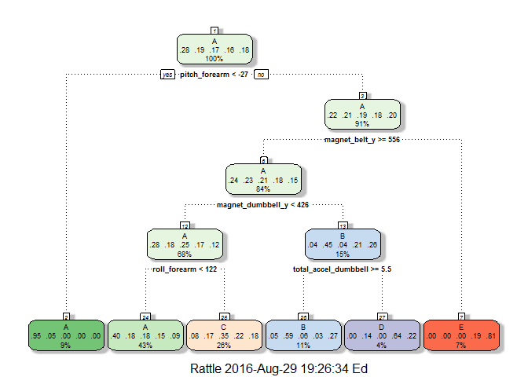

# Practical Machine Learning Assignment
Eamon Corr  
28 August 2016  

##Executive Summary
This report constructs and tests various prediction models to predict the manner or how well participants perform barbell lifts (correctly or incorrectly). The 'classe' variable in the training set predicts the manner in which they did the exercise and we use data from accelerometers on the belt, forearm, arm, and dumbbell of 6 participants to make predictions.
This report identifies the most relevant features and applies a model-based approach to detect mistakes in exercise techniques. Processing and analysis is carried out on the datasets and cross validation techniques applied. In this exercise we build and test various prediction models including Trees, boosting and Random Forest. The Out of Sample Error is then calculated using the most accurate model, Random Forest (accuracy of 0.994) in this case, and applied to a set of twenty different independent test cases.

More information is available from the Pontifical Catholic University of Rio de Janeiro website:
[puc-rio.br/har](http://groupware.les.inf.puc-rio.br/har) (see the section on the Weight Lifting Exercise Dataset).

I would like to thank PUC Rio for their generosity in providing access to their Human Activity Recognition datasets.

##Loading & Data Processing


```r
library(plyr);library(dplyr);library(caret)
library(ggplot2); library(rattle)
```


```r
#if (!file.exists('data')) {
#      dir.create('data')
#}
#fileUrl <- 'https://d396qusza40orc.cloudfront.net/predmachlearn/pml-training.csv'
#download.file(fileUrl, destfile = './data/pml_training.csv', method='curl')
#fileUrl <- 'https://d396qusza40orc.cloudfront.net/predmachlearn/pml-testing.csv'
#download.file(fileUrl, destfile = './data/pml_testing.csv', method='curl')
list.files('./data')
```

```
## [1] "pml_testing.csv"  "pml_training.csv"
```

```r
#datadownloaded <- date()
```


```r
pml_training <- read.csv('./data/pml_training.csv',na.strings=c('#DIV/0!', 'NA'))
pml_testing <- read.csv('./data/pml_testing.csv', na.strings=c('#DIV/0!', 'NA'))
```

##Exploratory Data Analysis
Check the dataset's dimensions, variables and characteristics.

```r
dim(pml_training);dim(pml_testing);
```

```
## [1] 19622   160
```

```
## [1]  20 160
```

```r
table(pml_training$user_name)
```

```
## 
##   adelmo carlitos  charles   eurico   jeremy    pedro 
##     3892     3112     3536     3070     3402     2610
```

```r
tbl_df(pml_training[,8:50])
```

```
## Source: local data frame [19,622 x 43]
## 
##    roll_belt pitch_belt yaw_belt total_accel_belt kurtosis_roll_belt
##        (dbl)      (dbl)    (dbl)            (int)              (dbl)
## 1       1.41       8.07    -94.4                3                 NA
## 2       1.41       8.07    -94.4                3                 NA
## 3       1.42       8.07    -94.4                3                 NA
## 4       1.48       8.05    -94.4                3                 NA
## 5       1.48       8.07    -94.4                3                 NA
## 6       1.45       8.06    -94.4                3                 NA
## 7       1.42       8.09    -94.4                3                 NA
## 8       1.42       8.13    -94.4                3                 NA
## 9       1.43       8.16    -94.4                3                 NA
## 10      1.45       8.17    -94.4                3                 NA
## ..       ...        ...      ...              ...                ...
## Variables not shown: kurtosis_picth_belt (dbl), kurtosis_yaw_belt (lgl),
##   skewness_roll_belt (dbl), skewness_roll_belt.1 (dbl), skewness_yaw_belt
##   (lgl), max_roll_belt (dbl), max_picth_belt (int), max_yaw_belt (dbl),
##   min_roll_belt (dbl), min_pitch_belt (int), min_yaw_belt (dbl),
##   amplitude_roll_belt (dbl), amplitude_pitch_belt (int),
##   amplitude_yaw_belt (dbl), var_total_accel_belt (dbl), avg_roll_belt
##   (dbl), stddev_roll_belt (dbl), var_roll_belt (dbl), avg_pitch_belt
##   (dbl), stddev_pitch_belt (dbl), var_pitch_belt (dbl), avg_yaw_belt
##   (dbl), stddev_yaw_belt (dbl), var_yaw_belt (dbl), gyros_belt_x (dbl),
##   gyros_belt_y (dbl), gyros_belt_z (dbl), accel_belt_x (int), accel_belt_y
##   (int), accel_belt_z (int), magnet_belt_x (int), magnet_belt_y (int),
##   magnet_belt_z (int), roll_arm (dbl), pitch_arm (dbl), yaw_arm (dbl),
##   total_accel_arm (int), var_accel_arm (dbl)
```

```r
summary(pml_training[,8:20])
```

```
##    roll_belt        pitch_belt          yaw_belt       total_accel_belt
##  Min.   :-28.90   Min.   :-55.8000   Min.   :-180.00   Min.   : 0.00   
##  1st Qu.:  1.10   1st Qu.:  1.7600   1st Qu.: -88.30   1st Qu.: 3.00   
##  Median :113.00   Median :  5.2800   Median : -13.00   Median :17.00   
##  Mean   : 64.41   Mean   :  0.3053   Mean   : -11.21   Mean   :11.31   
##  3rd Qu.:123.00   3rd Qu.: 14.9000   3rd Qu.:  12.90   3rd Qu.:18.00   
##  Max.   :162.00   Max.   : 60.3000   Max.   : 179.00   Max.   :29.00   
##                                                                        
##  kurtosis_roll_belt kurtosis_picth_belt kurtosis_yaw_belt
##  Min.   :-2.121     Min.   :-2.190      Mode:logical     
##  1st Qu.:-1.329     1st Qu.:-1.107      NA's:19622       
##  Median :-0.899     Median :-0.151                       
##  Mean   :-0.220     Mean   : 4.334                       
##  3rd Qu.:-0.219     3rd Qu.: 3.178                       
##  Max.   :33.000     Max.   :58.000                       
##  NA's   :19226      NA's   :19248                        
##  skewness_roll_belt skewness_roll_belt.1 skewness_yaw_belt
##  Min.   :-5.745     Min.   :-7.616       Mode:logical     
##  1st Qu.:-0.444     1st Qu.:-1.114       NA's:19622       
##  Median : 0.000     Median :-0.068                        
##  Mean   :-0.026     Mean   :-0.296                        
##  3rd Qu.: 0.417     3rd Qu.: 0.661                        
##  Max.   : 3.595     Max.   : 7.348                        
##  NA's   :19225      NA's   :19248                         
##  max_roll_belt     max_picth_belt   max_yaw_belt  
##  Min.   :-94.300   Min.   : 3.00   Min.   :-2.10  
##  1st Qu.:-88.000   1st Qu.: 5.00   1st Qu.:-1.30  
##  Median : -5.100   Median :18.00   Median :-0.90  
##  Mean   : -6.667   Mean   :12.92   Mean   :-0.22  
##  3rd Qu.: 18.500   3rd Qu.:19.00   3rd Qu.:-0.20  
##  Max.   :180.000   Max.   :30.00   Max.   :33.00  
##  NA's   :19216     NA's   :19216   NA's   :19226
```

```r
sum(is.na(pml_training$max_roll_belt)) #example of NAs
```

```
## [1] 19216
```
The data is multi-dimensional / multi-class and it is difficult to get a picture of what's 
going on. Reading the data into R initially we see some measurements with mislabelled entries (#DIV/0!). 
Some 53 variables have a large numbers of NAs (see 'max_roll_belt' example above), usually 19216+ out of a total of 19622 observations.Although the values in these columns appear genuine they do appear to be summary values rather than measurements.
We will remove the mislabelled entries when reading the data into R and also the variables with a large number of NAs.
We will further reduce the columns by removing time related and non-accelerometer measurement labels.
These changes will also be applied to the pml_testing dataset. 


```r
pml_training <- pml_training[, -(1:7)]
withNA <- colSums(is.na(pml_training)) ==0
namesWithNA <- names(pml_training[,withNA])
pml_training <- pml_training[, namesWithNA]

pml_testing <- pml_testing[, -(1:7)]
withNA <- colSums(is.na(pml_testing)) ==0
namesWithNA <- names(pml_testing[,withNA])
pml_testing <- pml_testing[, namesWithNA]

dim(pml_training);dim(pml_testing);
```

```
## [1] 19622    53
```

```
## [1] 20 53
```

We can also check and ensure there are no Zero Covariates (variables with no variability). In this case there are none.

```r
nsv <- nearZeroVar(pml_training, saveMetrics=TRUE)
head(nsv)
```

```
##                  freqRatio percentUnique zeroVar   nzv
## roll_belt         1.101904     6.7781062   FALSE FALSE
## pitch_belt        1.036082     9.3772296   FALSE FALSE
## yaw_belt          1.058480     9.9734991   FALSE FALSE
## total_accel_belt  1.063160     0.1477933   FALSE FALSE
## gyros_belt_x      1.058651     0.7134849   FALSE FALSE
## gyros_belt_y      1.144000     0.3516461   FALSE FALSE
```

```r
#cont ...
```

We identify Variables that are highly correlated using the 'highlycorrelated' function.

```r
highlycorrelated <- function(dataframe,numToReport)
{
      # find the correlations in dataset
      cormatrix <- cor(dataframe[sapply(dataframe, is.numeric)])
      # set correlations on the diagonal or lower triangle to 0,
      diag(cormatrix) <- 0
      cormatrix[lower.tri(cormatrix)] <- 0
      # convert matrix to a dataframe
      df <- as.data.frame(as.table(cormatrix))
      names(df) <- c("1st Variable", "2nd Variable","Correlation")
      # sort correlations from highest to lowest
      head(df[order(abs(df$Correlation),decreasing=T),],n=numToReport)
}
highlycorrelated(pml_training, 12)
```

```
##          1st Variable     2nd Variable Correlation
## 469         roll_belt     accel_belt_z  -0.9920085
## 157         roll_belt total_accel_belt   0.9809241
## 1695 gyros_dumbbell_x gyros_dumbbell_z  -0.9789507
## 472  total_accel_belt     accel_belt_z  -0.9749317
## 366        pitch_belt     accel_belt_x  -0.9657334
## 477      accel_belt_y     accel_belt_z  -0.9333854
## 2373 gyros_dumbbell_z  gyros_forearm_z   0.9330422
## 420  total_accel_belt     accel_belt_y   0.9278069
## 417         roll_belt     accel_belt_y   0.9248983
## 954       gyros_arm_x      gyros_arm_y  -0.9181821
## 2371 gyros_dumbbell_x  gyros_forearm_z  -0.9144764
## 528      accel_belt_x    magnet_belt_x   0.8920913
```


We remove correlated variables from the datasets.

```r
cormatrix <- cor(pml_training[sapply(pml_training, is.numeric)])
corrVars <- findCorrelation(cormatrix, cutoff =0.90)
pml_training <- pml_training[,-corrVars]
pml_testing <- pml_testing[,-corrVars] #pml_testing dataset

dim(pml_training); dim(pml_testing)
```

```
## [1] 19622    46
```

```
## [1] 20 46
```

##Cross Validation
The pml_training dataset will be split into training and test sets. The training and test datasets
will be used to create and then test the prediction model respectively. The chosen model will then be 
employed to predict 20 different test cases (pml_testing dataset).


```r
set.seed(123)
inTrain <- createDataPartition(y=pml_training$classe, p=0.75, list=FALSE)
training <- pml_training[inTrain,]
testing <- pml_training[-inTrain,]
dim(training); dim(testing)
```

```
## [1] 14718    46
```

```
## [1] 4904   46
```

##Predict with Trees
####Build the Trees Prediction Model

```r
modFitTree <- train(classe ~., method ='rpart', data=training)
```

```
## Loading required package: rpart
```

```r
print(modFitTree$finalModel)
```

```
## n= 14718 
## 
## node), split, n, loss, yval, (yprob)
##       * denotes terminal node
## 
##  1) root 14718 10533 A (0.28 0.19 0.17 0.16 0.18)  
##    2) pitch_forearm< -26.65 1325    60 A (0.95 0.045 0 0 0) *
##    3) pitch_forearm>=-26.65 13393 10473 A (0.22 0.21 0.19 0.18 0.2)  
##      6) magnet_belt_y>=555.5 12292  9375 A (0.24 0.23 0.21 0.18 0.15)  
##       12) magnet_dumbbell_y< 426.5 10075  7243 A (0.28 0.18 0.25 0.17 0.12)  
##         24) roll_forearm< 121.5 6294  3749 A (0.4 0.18 0.18 0.15 0.088) *
##         25) roll_forearm>=121.5 3781  2465 C (0.076 0.17 0.35 0.22 0.18) *
##       13) magnet_dumbbell_y>=426.5 2217  1212 B (0.038 0.45 0.044 0.21 0.26)  
##         26) total_accel_dumbbell>=5.5 1559   646 B (0.055 0.59 0.06 0.028 0.27) *
##         27) total_accel_dumbbell< 5.5 658   238 D (0 0.14 0.0046 0.64 0.22) *
##      7) magnet_belt_y< 555.5 1101   212 E (0.0027 0.0018 0.00091 0.19 0.81) *
```

```r
fancyRpartPlot(modFitTree$finalModel)
```

\

####Predict the test dataset using the Trees Model


```r
predTree <- predict(modFitTree, newdata=testing)
cmTree <- confusionMatrix(predTree, testing$classe)
print(cmTree)
```

```
## Confusion Matrix and Statistics
## 
##           Reference
## Prediction    A    B    C    D    E
##          A 1263  389  411  307  201
##          B   31  293   32   17  123
##          C  101  241  411  285  231
##          D    0   24    0  135   45
##          E    0    2    1   60  301
## 
## Overall Statistics
##                                           
##                Accuracy : 0.49            
##                  95% CI : (0.4759, 0.5041)
##     No Information Rate : 0.2845          
##     P-Value [Acc > NIR] : < 2.2e-16       
##                                           
##                   Kappa : 0.334           
##  Mcnemar's Test P-Value : < 2.2e-16       
## 
## Statistics by Class:
## 
##                      Class: A Class: B Class: C Class: D Class: E
## Sensitivity            0.9054  0.30875  0.48070  0.16791  0.33407
## Specificity            0.6272  0.94867  0.78810  0.98317  0.98426
## Pos Pred Value         0.4912  0.59073  0.32388  0.66176  0.82692
## Neg Pred Value         0.9434  0.85118  0.87785  0.85766  0.86784
## Prevalence             0.2845  0.19352  0.17435  0.16395  0.18373
## Detection Rate         0.2575  0.05975  0.08381  0.02753  0.06138
## Detection Prevalence   0.5243  0.10114  0.25877  0.04160  0.07423
## Balanced Accuracy      0.7663  0.62871  0.63440  0.57554  0.65917
```
As we can see that this model has a pretty poor accuracy at just 0.49.

##Predict with Random Forest
####Build the RF Prediction Model

Note: trainControl method parameter is set to 'cv' rather than bootstrapping, which is the default.


```r
trControl <- trainControl(method='cv', number=5, allowParallel=TRUE, verbose=F)
modFitRF <- train(classe~., data=training, method='rf', trControl=trControl)
```

```r
print(modFitRF)
```

```
## Random Forest 
## 
## 14718 samples
##    45 predictor
##     5 classes: 'A', 'B', 'C', 'D', 'E' 
## 
## No pre-processing
## Resampling: Cross-Validated (5 fold) 
## Summary of sample sizes: 11775, 11774, 11775, 11775, 11773 
## Resampling results across tuning parameters:
## 
##   mtry  Accuracy   Kappa    
##    2    0.9915750  0.9893418
##   23    0.9915069  0.9892565
##   45    0.9858676  0.9821213
## 
## Accuracy was used to select the optimal model using  the largest value.
## The final value used for the model was mtry = 2.
```

```r
print(modFitRF$finalModel)
```

```
## 
## Call:
##  randomForest(x = x, y = y, mtry = param$mtry) 
##                Type of random forest: classification
##                      Number of trees: 500
## No. of variables tried at each split: 2
## 
##         OOB estimate of  error rate: 0.73%
## Confusion matrix:
##      A    B    C    D    E  class.error
## A 4182    2    0    1    0 0.0007168459
## B   17 2819   12    0    0 0.0101825843
## C    0   21 2540    6    0 0.0105181145
## D    1    0   40 2369    2 0.0178275290
## E    0    0    1    4 2701 0.0018477458
```

####Predict the test dataset using the RF Model

```r
predRF <- predict(modFitRF, newdata=testing)
cmRF <- confusionMatrix(predRF, testing$classe)
cmRF
```

```
## Confusion Matrix and Statistics
## 
##           Reference
## Prediction    A    B    C    D    E
##          A 1394    3    0    0    0
##          B    1  944    8    0    0
##          C    0    2  846   21    0
##          D    0    0    1  781    2
##          E    0    0    0    2  899
## 
## Overall Statistics
##                                           
##                Accuracy : 0.9918          
##                  95% CI : (0.9889, 0.9942)
##     No Information Rate : 0.2845          
##     P-Value [Acc > NIR] : < 2.2e-16       
##                                           
##                   Kappa : 0.9897          
##  Mcnemar's Test P-Value : NA              
## 
## Statistics by Class:
## 
##                      Class: A Class: B Class: C Class: D Class: E
## Sensitivity            0.9993   0.9947   0.9895   0.9714   0.9978
## Specificity            0.9991   0.9977   0.9943   0.9993   0.9995
## Pos Pred Value         0.9979   0.9906   0.9735   0.9962   0.9978
## Neg Pred Value         0.9997   0.9987   0.9978   0.9944   0.9995
## Prevalence             0.2845   0.1935   0.1743   0.1639   0.1837
## Detection Rate         0.2843   0.1925   0.1725   0.1593   0.1833
## Detection Prevalence   0.2849   0.1943   0.1772   0.1599   0.1837
## Balanced Accuracy      0.9992   0.9962   0.9919   0.9853   0.9986
```
This particular model shows a very high accuarcy.

##Predict with Boosting
####Build the Prediction Model


```r
trControl <- trainControl(method='cv', number=10, allowParallel=TRUE, verbose=F)
modFitGBM <- train(classe~., data=training, method='gbm', trControl=trControl)
```


```r
print(modFitGBM)
```

```
## Stochastic Gradient Boosting 
## 
## 14718 samples
##    45 predictor
##     5 classes: 'A', 'B', 'C', 'D', 'E' 
## 
## No pre-processing
## Resampling: Cross-Validated (10 fold) 
## Summary of sample sizes: 13249, 13246, 13247, 13246, 13247, 13246, ... 
## Resampling results across tuning parameters:
## 
##   interaction.depth  n.trees  Accuracy   Kappa    
##   1                   50      0.7397736  0.6700366
##   1                  100      0.8122697  0.7623479
##   1                  150      0.8453603  0.8042249
##   2                   50      0.8521524  0.8127175
##   2                  100      0.9059650  0.8809907
##   2                  150      0.9281827  0.9091250
##   3                   50      0.8941409  0.8660082
##   3                  100      0.9419064  0.9264907
##   3                  150      0.9595043  0.9487673
## 
## Tuning parameter 'shrinkage' was held constant at a value of 0.1
## 
## Tuning parameter 'n.minobsinnode' was held constant at a value of 10
## Accuracy was used to select the optimal model using  the largest value.
## The final values used for the model were n.trees = 150,
##  interaction.depth = 3, shrinkage = 0.1 and n.minobsinnode = 10.
```

```r
print(modFitGBM$finalModel)
```

```
## A gradient boosted model with multinomial loss function.
## 150 iterations were performed.
## There were 45 predictors of which 42 had non-zero influence.
```

####Predict the test dataset using the GBM Model

```r
predGBM <- predict(modFitGBM, newdata=testing)
cmGBM <- confusionMatrix(predGBM, testing$classe)
cmGBM
```

```
## Confusion Matrix and Statistics
## 
##           Reference
## Prediction    A    B    C    D    E
##          A 1374   26    0    1    4
##          B    8  899   30    4    7
##          C   11   22  808   31    9
##          D    2    0   15  758   12
##          E    0    2    2   10  869
## 
## Overall Statistics
##                                           
##                Accuracy : 0.96            
##                  95% CI : (0.9542, 0.9653)
##     No Information Rate : 0.2845          
##     P-Value [Acc > NIR] : < 2.2e-16       
##                                           
##                   Kappa : 0.9494          
##  Mcnemar's Test P-Value : 4.826e-06       
## 
## Statistics by Class:
## 
##                      Class: A Class: B Class: C Class: D Class: E
## Sensitivity            0.9849   0.9473   0.9450   0.9428   0.9645
## Specificity            0.9912   0.9876   0.9820   0.9929   0.9965
## Pos Pred Value         0.9779   0.9483   0.9171   0.9632   0.9841
## Neg Pred Value         0.9940   0.9874   0.9883   0.9888   0.9920
## Prevalence             0.2845   0.1935   0.1743   0.1639   0.1837
## Detection Rate         0.2802   0.1833   0.1648   0.1546   0.1772
## Detection Prevalence   0.2865   0.1933   0.1796   0.1605   0.1801
## Balanced Accuracy      0.9881   0.9675   0.9635   0.9679   0.9805
```
This model also has a high accuracy but not as high as the Random Forest Model.

##Accuracy Results for all Models 

```r
results <- c(cmTree$overall[1], cmRF$overall[1], cmGBM$overall[1])
names(results) <- c('Trees','RF', 'GBM')
print(results)
```

```
##     Trees        RF       GBM 
## 0.4900082 0.9918434 0.9600326
```
Considering all three models we can say that the Random Forest model has the highest accuracy.
Therefore the Random forest model will be used to predict the 20 different test cases.

##Predicting the Out of Sample Error
####Predict the pml_testing dataset

```r
prediction <- predict(modFitRF, newdata=pml_testing)
print(prediction)
```

```
##  [1] B A B A A E D B A A B C B A E E A B B B
## Levels: A B C D E
```
